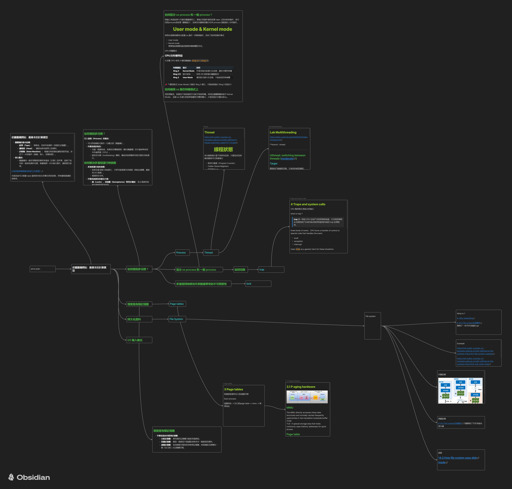

# MIT6.1810 作業系統實作課程

本專案為自學 MIT 6.1810 / 6.828 (Fall 2022) 作業系統課程的實驗內容，使用 xv6 作為教學作業系統，透過實作學習作業系統核心原理。

課程連結：[MIT 6.828 Fall 2022](https://pdos.csail.mit.edu/6.828/2022/)

## LAB

- [x] [Lab 1: System calls](./doc/LAB/Lab%20system%20calls.md)
- [x] [Lab 2: Page tables](./doc/LAB/Lab%20page%20tables.md)    
- [ ] Lab 3: Traps
- [x] [Lab 4: Cpoy-on-write](./doc/LAB/Lab%20Copy-on-Write%20Fork%20for%20xv6.md)
- [x] [Lab 5: Multithreading](./doc/LAB/Lab%20Multithreading.md)

📄 Lab 文件連結均為個人實作紀錄。

