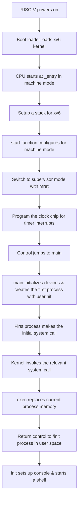

https://pdos.csail.mit.edu/6.828/2022/labs/syscall.html

```sh
# 評分測試
make grade
```


>Before you start coding, read Chapter 2 of the [xv6 book](https://pdos.csail.mit.edu/6.828/2022/xv6/book-riscv-rev1.pdf), and Sections 4.3 and 4.4 of Chapter 4, and related source files:
>* The user-space "stubs" that route system calls into the kernel are in user/usys.S, which is generated by user/usys.pl when you run make. Declarations are in user/user.h
>* The kernel-space code that routes a system call to the kernel function that implements it is in kernel/syscall.c and kernel/syscall.h.
>* Process-related code is kernel/proc.h and kernel/proc.c.



---

## Using gdb

```sh
# Remember to go under the project directory

make qemu-gdb

# another window
gdb-multiarch

# in gdb-multiarch
file kernel/syscall.o   #Specify breakpoint file
target remote localhost:25000
b syscall    #breakpoint
c    # continue
```
![[assets/Pasted image 20230911171957.png]]


## System call tracing

**Prerequisite Knowledge**
* Need read 2.6 section
* Upon invoking `ecall`, the system switches to `supervisor mode` and executes the `syscall()` located at `kernel/syscall.c:132`.
* *`exec()`: The process remains unchanged and the current process is replaced. The original process settings are still there.

```sh
trace 32 grep hello README
```

The value "32" here specifies the set of system calls to trace, using a mask for determination. 
For instance:
32 --> 100000 in binary representation.
This means that any system call that matches a position with a binary '1' in the mask would be included in the set to be traced.

To determine if a system call is covered by the mask, we can follow these steps:

1. Each system call has a call number, which can be found in `kernel/syscall.h`.
2. Convert this call number to its binary mask representation using the formula `(1 << SYS_CALL_NUMBER)`. 
For example:
For `SYS_exit` with call number 2: 
`(1 << 2)` results in `100` in binary.
Given the mask `100000`, this system call wouldn't match and thus, wouldn't be traced.

**Modified part**
```sh

```

**debug**
```
file kernel/kernel
target remote localhost:25000
```

**grade**
```sh
./grade-lab-syscall trace
```

**Reflect**
This assignment refers to other people’s problem-solving ideas on the Internet.
* If you haven’t read Section 2.6, calling ecall will call syscall.
* Not understanding exec().
---

## References

* https://github.com/FrankZn/xv6-riscv-book-Chinese/blob/main/Chapter-2.md